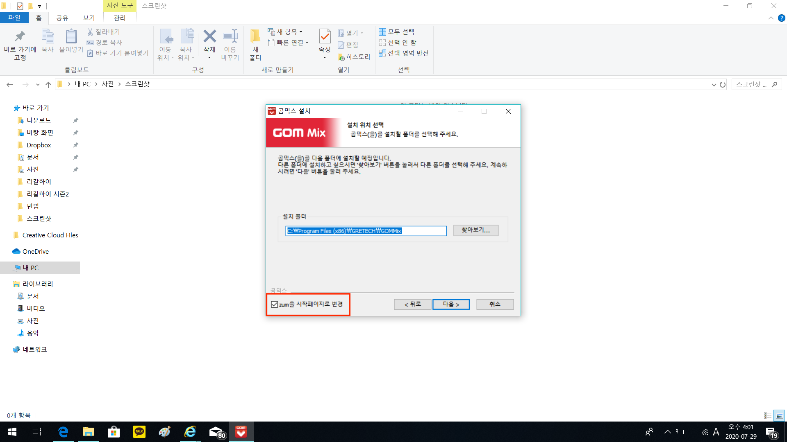
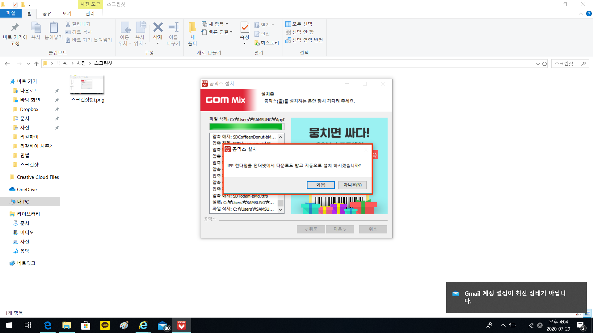
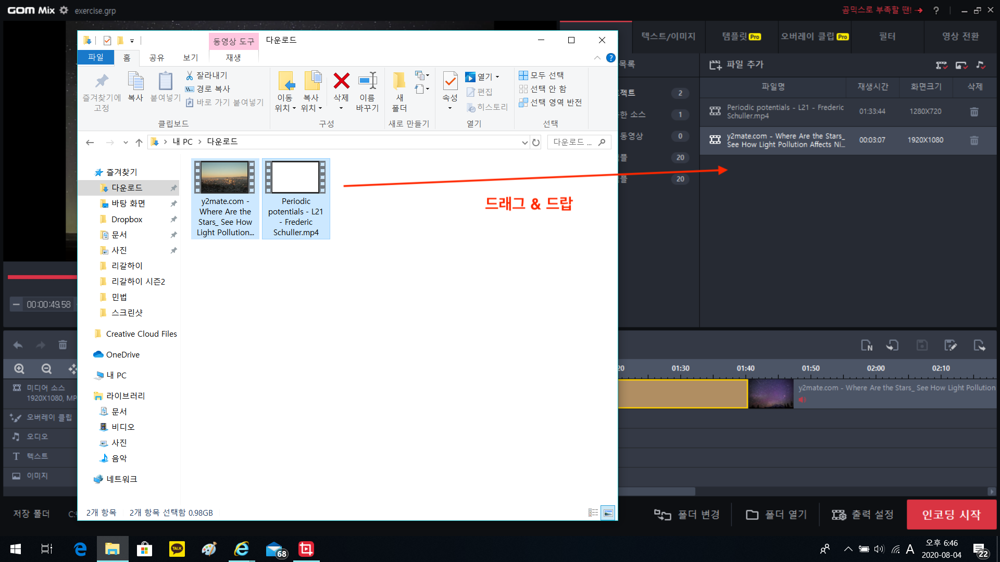

# 2020 충주 나눔교실 동영상 편집

일단 완성본을 봅시다.

<https://www.youtube.com/watch?v=30McOU6AB9A>

## 여러분이 하실 일

* 인트로 이후 영상의 컷편집
* 인트로에 들어가 소개클립(5초 가량) 골라주기: 소리는 안나옵니다.

## 편집 프로그램

> 편집 프로그램으로는 곰믹스를 사용하도록 하겠습니다.

* 무료
* 윈도우 OS 지원 (맥/리눅스 지원 X)
* 10분이면 다 배울 수 있음 (할머니 할아버지 유튜버들 쓰는 프로그램임)
* 컷편집 하기에 충분!

다운로드 링크: <https://software.naver.com/software/summary.nhn?softwareId=GWS_001665>

위의 링크에서 `곰믹스`를 다운받아서 설치해주세요. 설치 시간 살짝 걸림(5분 가량?)

중간에 zum을 시작페이지로 갈아치는 함정 조심하시고 (체크박스 해제)

ACC코덱을 다운받아 어쩌구.. IPP 런타임을 다운받아 어쩌구 하면서 계속 물어보는데 다 `YES`!

## 다음 희의때까지 할 일

곰믹스를 설치하시고 컷편집 배울 수 있는 유튜브 링크를 올려드리니 시청해주세요! 20분밖에 안합니다.

강의: <https://www.youtube.com/watch?v=c2qffHB7tF4>

## 편집 가이드

이렇게 각자 알아서 공부해서 하라고 하면 조금 막막할듯 하여 편집 가이드를 올려드립니다. 실전적인 예시를 위해 다음 영상 2개를 사용하도록 하죠! 모두 제가 샘플 영상을 만들 때 사용한 소스 영상들입니다.

* 영상 1: 네셔널 지오그래픽에서 빛공해의 심각성을 알리기 위해 찍은 밤하늘 타입랩스 영상입니다. FHD 1080p이고 오프닝에서 예지몽의 배경으로 사용된 영상 소스입니다. 총 길이는 2분 남짓입니다.
* 영상 2: Frederic Schuller라는 응용수학과 이론물리를 가르치시는 교수님의 양자역학 마지막 수업영상입니다. 제가 (굉장히) 좋아하는 교수님으로 특히 양자역학 강의와 우주론 강의는 정말 경이롭습니다. 샘플 영상에서 수업영상으로 사용된 소스입니다. 2시간이 조금 넘는 분량입니다. 화질은 조금 떨어집니다.

자, 무얼 해 볼거냐... 영상 1에는 약 1분 40초부터 5초간 검은 화면이 들어있어요. 이걸 일단 잘라서 없앨겁니다. 그리고 영상 1의 끝부분에 엔딩 크레딧이 있는데 그것도 잘라 없앨겁니다. 이후에 영상 2를 붙여서 우주의 신비를 보여 준 다음 이를 수학과 물리로 풀어내는 아름답고 감동적인 영상을 만들어보려고 해요.

#### STEP 1 영상 불러오기

곰믹스를 켜서 영상을 불러옵니다. 처음 켜먼 **미디어 소스**탭의 **현재 프로젝트** 패널이 비어있을텐데 그곳으로 파일을 드래그 & 드랍해주세요.

## 난 다른 영상편집 프로그램 쓸 줄 아는데?

파컷이나 프리미어, 에펙 같은걸 이미 쓸 줄 아신다구요? 그럼 그냥 그거 쓰셔도 됩니다! 다만 나중에 출력 양식만 H.264인코딩에 높은 비트레이트(프리미어는 익스포트 프리셋 중 youtube 1080p FHD)로 맞춰서 익스포트 해 주세요. 이게 뭔 말인지 모르겠으면 그냥 곰믹스 ㄱ