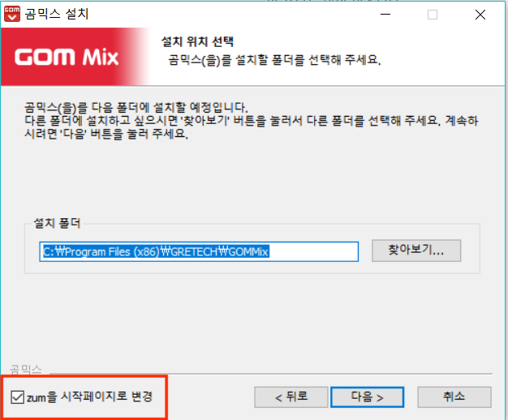
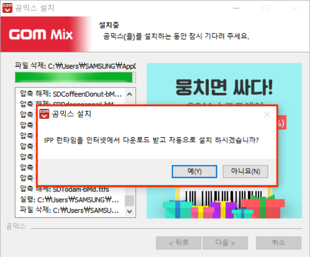
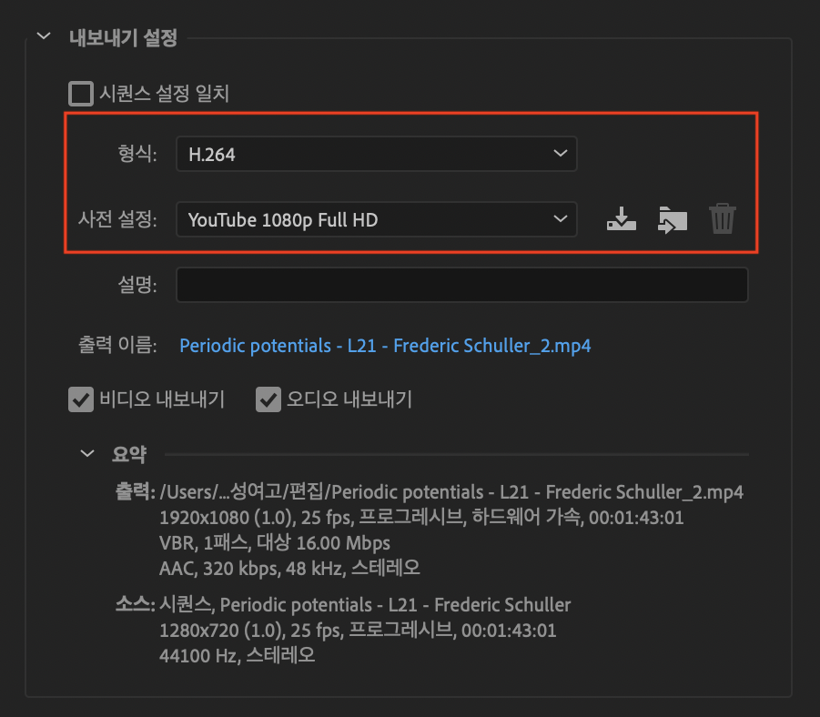

# 2020 충주 나눔교실 동영상 편집

샘플 영상: <https://www.youtube.com/watch?v=30McOU6AB9A>

## 여러분이 하실 일

* 인트로 이후 영상의 컷편집
* 인트로에 들어가 소개클립(5초 가량) 골라주기: 소리는 안나옵니다.

## 편집 프로그램

편집 프로그램을 이것저것 만지작 하다가 두 가지를 정했습니다.

> 곰믹스 or 반디컷

* 무료
* 윈도우 OS 지원 (맥/리눅스 지원 X)
* 아주 쉬움. 10분이면 다 배울 수 있음
* 컷편집 하기에 충분!

왜 곰믹스에 반디컷을 추가했냐... ~곰믹스가 여러분의 컴퓨터를 날려먹을까봐 무서워서~ 다음의 차이점 때문입니다.

* 곰믹스는 반디컷보다 기능이 많습니다. 중간에 영어듣기같이 오디오를 끼워넣을 수도 있고 화면전환도 할 수 있어요. 반면, 반디컷은 정말 붙이기와 자르기만 됩니다.
* 반디컷은 곰믹스보다 속도가 빠릅니다. 30분짜리 영상을 붙이고 자르는 데 10분이면 됩니다. ~아마도..~ (5년 전에 산 사망직전 노트북으로 시험해봄)

따라서 여러분이 각자 선택해서 사용하시면 되겠습니다! 만약 화면전환도 좀 넣고싶고 이것저것 만져보고 싶으면 곰믹스를 사용하시면 되고, 그딴거 다 필요없고 빨리하고 치우려면 반디컷으로 하시면 됩니다. ㅎㅎ 일단 설명은 둘 다 적어뒀어요~

### 곰믹스 설치

다운로드 링크: <https://software.naver.com/software/summary.nhn?softwareId=GWS_001665>

위의 링크에서 곰믹스를 다운받을 수 있습니다. 설치 시간 살짝 걸림(5분 가량?)

중간에 zum을 시작페이지로 갈아치는 함정 조심하시고 (체크박스 해제)

ACC 코덱을 다운받아 어쩌구.. IPP 런타임을 다운받아 어쩌구 하면서 계속 물어보는데 다 `YES`!

### 반디컷 설치

다운로드 링크: <https://www.bandicam.co.kr/bandicut-video-cutter/download/>

위의 링크에서 반디컷을 다운받을 수 있습니다. 최신베타나 최신버전이나 큰 차이 없을듯...

## 사용법 YouTube

두 프로그램 모두 사용법은 간단하고 직관적입니다. 사실 반디컷은 사용법이라할 것도 없어요... 그래도 일단 유튜브 강좌를 찾아 올려드립니다. 필요하다면 참고하시면 되겠습니다.

곰믹스: <https://www.youtube.com/watch?v=c2qffHB7tF4>

반디컷: <https://www.youtube.com/watch?v=C4yjJxk1hmg>

## 영상 출력

원래 구구절절 있었던 내용은 이제 다들 읽으셨을테니 정말 중요한 부분인 영상 출력(내보내기, 인코딩) 부분만 간단히 정리해둘게요!

### 프리미어 프로

내보내기 설정에서 **인코딩은 H.264**로 **사전설정은 YouTube 1080p Full HD**로 해서 나머지 아무것도 건드리지 말고 인코딩해주세요.

