# 2020 충주 나눔교실 동영상 편집

일단 완성본을 봅시다.

<https://www.youtube.com/watch?v=30McOU6AB9A>

## 여러분이 하실 일

* 인트로 이후 영상의 컷편집
* 인트로에 들어가 소개클립(5초 가량) 골라주기: 소리는 안나옵니다.

## 편집 프로그램

편집 프로그램을 이것저것 만지작 하다가 두 가지를 정했습니다.

> 곰믹스 or 반디컷

* 무료
* 윈도우 OS 지원 (맥/리눅스 지원 X)
* 아주 쉬움. 10분이면 다 배울 수 있음
* 컷편집 하기에 충분!

왜 곰믹스에 반디컷을 추가했냐... ~곰믹스가 여러분의 컴퓨터를 날려먹을까봐 무서워서~ 다음의 차이점 때문입니다.

* 곰믹스는 반디컷보다 기능이 많습니다. 중간에 영어듣기같이 오디오를 끼워넣을 수도 있고 화면전환도 할 수 있어요. 반면, 반디컷은 정말 붙이기와 자르기만 됩니다.
* 반디컷은 곰믹스보다 속도가 빠릅니다. 30분짜리 영상을 붙이고 자르는 데 10분이면 됩니다. ~아마도.. 5년 전 사망직전 노트북으로 시험해봄~

따라서 여러분이 각자 선택해서 사용하시면 되겠습니다! 만약 화면전환도 좀 넣고싶고 이것저것 만져보고 싶으면 곰믹스를 사용하시면 되고, 그딴거 다 필요없고 빨리하고 치우려면 반디컷으로 하시면 됩니다. ㅎㅎ 일단 설명은 둘 다 적어뒀어요~

#### 곰믹스 설치

다운로드 링크: <https://software.naver.com/software/summary.nhn?softwareId=GWS_001665>

위의 링크에서 곰믹스를 다운받을 수 있습니다. 설치 시간 살짝 걸림(5분 가량?)

중간에 zum을 시작페이지로 갈아치는 함정 조심하시고 (체크박스 해제)

ACC 코덱을 다운받아 어쩌구.. IPP 런타임을 다운받아 어쩌구 하면서 계속 물어보는데 다 `YES`!

#### 반디컷 설치

다운로드 링크: <https://www.bandicam.co.kr/bandicut-video-cutter/download/>

위의 링크에서 반디컷을 다운받을 수 있습니다. 최신베타(왼쪽)이 아니라 최신버전(오른쪽)으로 받아주세요. 

## 사용법 YouTube

두 프로그램 모두 사용법은 간단하고 직관적입니다. 사실 반디컷은 사용법이라할 것도 없어요... 그래도 일단 유튜브 강좌를 찾아 올려드립니다. 필요하다면 참고하시면 되겠습니다.

곰믹스: <https://www.youtube.com/watch?v=c2qffHB7tF4>
반디컷: <https://www.youtube.com/watch?v=C4yjJxk1hmg>

## 편집 가이드

이렇게 각자 알아서 공부해서 하라고 하면 조금 막막할듯 하여 편집 가이드를 올려드립니다. 실전적인 예시를 위해 다음 영상 2개를 사용하도록 하죠! 모두 제가 샘플 영상을 만들 때 사용한 소스 영상들입니다.

* 영상 1: 네셔널 지오그래픽에서 빛공해의 심각성을 알리기 위해 찍은 밤하늘 타입랩스 영상입니다. FHD 1080p이고 오프닝에서 예지몽의 배경으로 사용된 영상 소스입니다. 총 길이는 2분 남짓입니다.
* 영상 2: Frederic Schuller라는 응용수학과 이론물리를 가르치시는 교수님의 양자역학 마지막 수업영상입니다. 제가 (굉장히) 좋아하는 교수님으로 특히 양자역학 강의와 우주론 강의는 정말 경이롭습니다. 샘플 영상에서 수업영상으로 사용된 소스입니다. 2시간이 조금 넘는 분량입니다. 화질은 조금 떨어집니다.

자, 무얼 해 볼거냐... 영상 1에는 약 1분 40초부터 중간에 검은 화면이 들어있어요. 이걸 일단 잘라서 없앨겁니다. 그리고 영상 1의 끝부분에 엔딩 크레딧이 있는데 그것도 잘라 없앨겁니다. 이후에 영상 2를 붙여서 우주의 신비를 보여 준 다음 이를 수학과 물리로 풀어내는 아름답고 감동적인 영상을 만들어보려고 해요.

#### STEP 1 영상 불러오기

곰믹스를 킵니다. 처음 켜먼 **미디어 소스**탭의 **현재 프로젝트** 패널이 비어있을텐데 그곳으로 파일을 드래그 & 드랍해주세요.

#### STEP 2 편집점 찾기

크게 볼 때, 컷편집은 STEP 1에서 불러온 소스영상을 아래쪽 타임라인에 적절히 배치해서 하나의 영상으로 만드는 과정입니다. STEP 1에서 현재 프로젝트 패널의 영상 중 영상 1(빛공해 영상)을 타임라인으로 역시 드래그 & 드랍하면 보시는 것처럼 딱 들어갑니다.
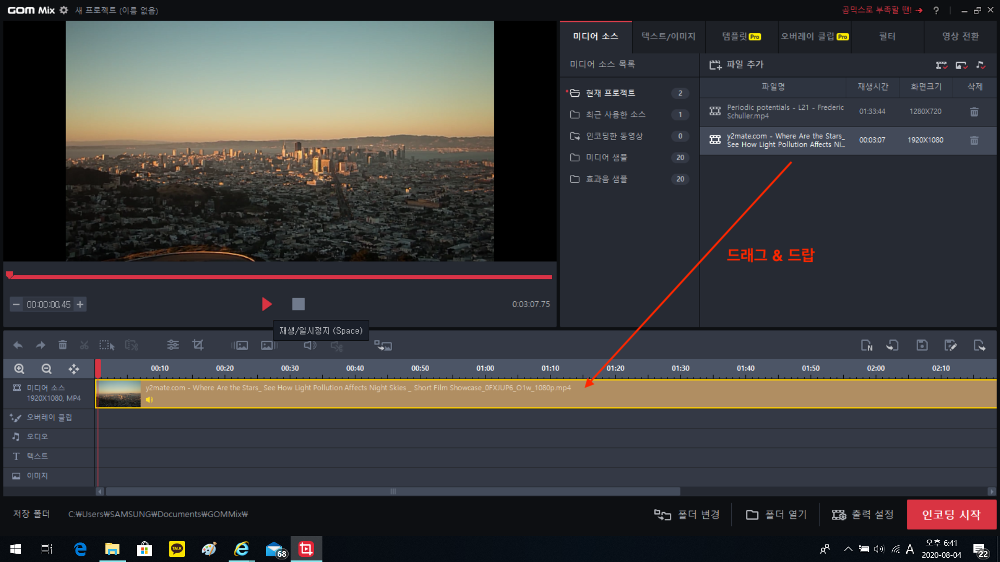
이제 중간의 검은 화면을 찾아야겠네요. 아래 그림에서 노란색 0표한 삼각형 버튼(단축기 `space`)을 누르면 현재 타임라인에 올라간 영상 소스가 차례대로 재생됩니다. 이에 더하여, 타임라인 쪽의 0표한 인디케이터도 따라서 움직일겁니다.
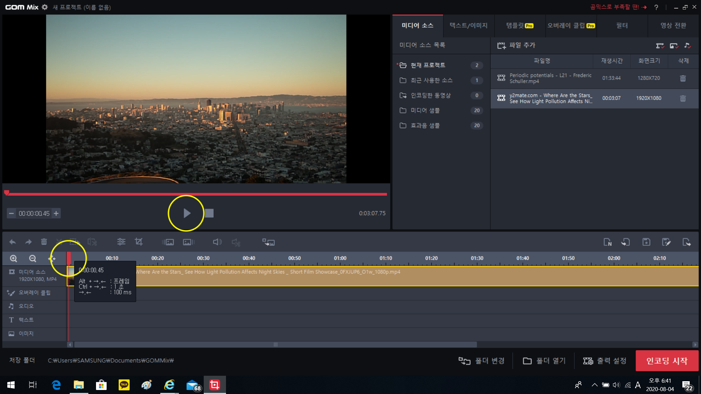
이 인디케이터는 한글에서 깜빡이는 커서 역할을 한다고 생각하시면 됩니다. 즉, 최종 영상에서의 현재 위치를 나타내는 역할을 인디케이터가 하게 되고, 이를 움직이여서 영상 전체를 헤집고 다닐 수가 있습니다. 우리는 1분 40초 즈음에 검은 화면이 있다는 걸 이미 알고 있으니 인디케이터를 움직여서 거기로 바로 갑시다.
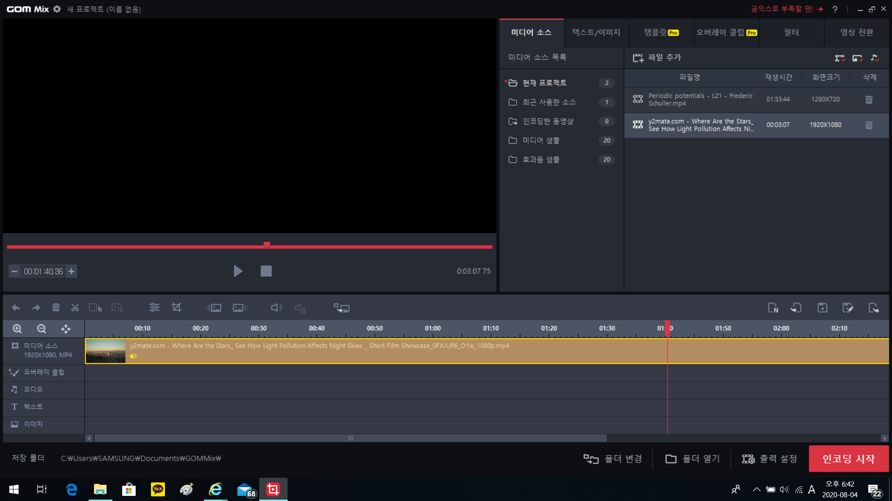

#### STEP 3 잘라내기

검은 화면 앞뒤로 영상을 끊어주고 그 사이를 지우면 되겠죠? 아래 그림에서 가위모양(단축기 `ctrl+X`)과 휴지통모양(단축키 `delete`)로 할 수 있습니다.
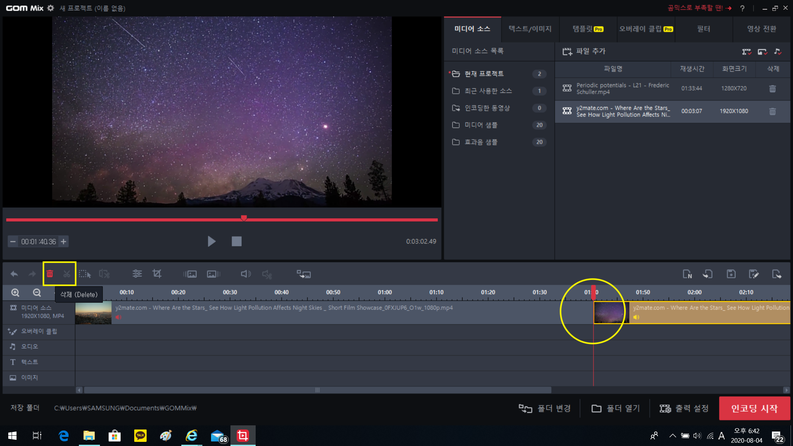
가위모양으로 영상을 자르면 인디케이터가 기리키는 곳을 기준으로 영상이 두쪽납니다. 위의 그림에서 타임라인을 보시면 원래 하나이던 영상이 쪼개진 걸 확인할 수 있어요. 이제 검은색 화면이 끝날 때까지 인디케이를 움직여 뒤로 간 다음, 다시 영상을 자릅니다.
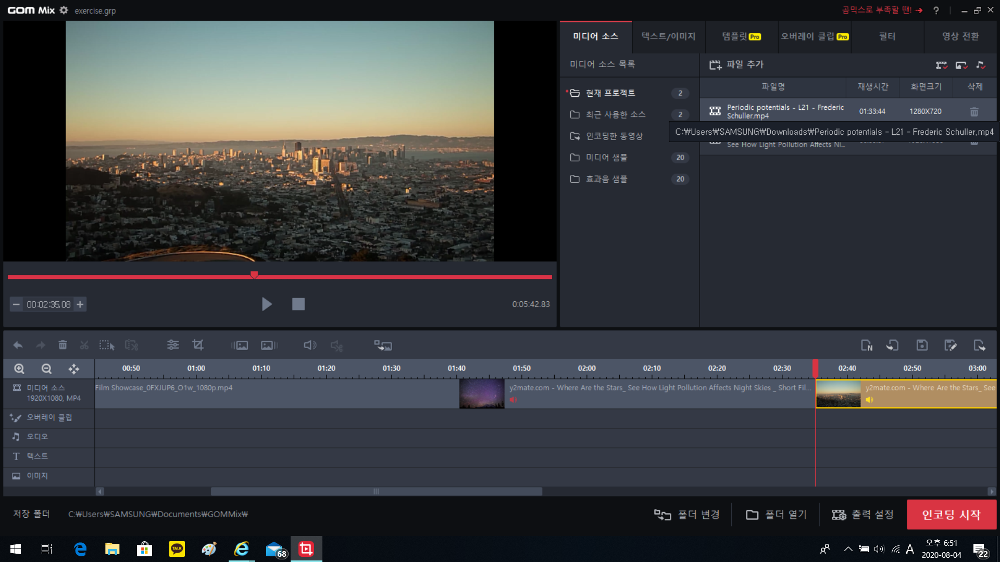
그리고 나서 휴지통 모양  혹은 단축키로 이를 날려버리면 됩니다.
이때 주의할 점: **날리기 전에 꼭 타임라인에서 해당 영역을 선택하고 날려야 합니다.** 아니면 엄한 영상이 날아가요. 선택한 영상은 타임라인에서 노란색으로 음영이 들어갑니다. 위의 그림에서는 뒤쪽 영상이 선택된 상황이니 중간 영상으로 클릭해서 선택한 다음에 날려야겠죠?

같은 방법으로 뒤의 엔딩 크래딧도 날려줍니다. 이건 생략~

#### STEP 4 이어붙이기

필요없는 부분을 잘랐으니 이제 이 뒤에 영상 2를 이어붙이면 되겠네요. 역시 현재 프로젝트 패널에서 영상 2를 드래그 & 드랍해서 타임라인의 맨 뒤부분에 넣습니다. 그럼 이어붙이기 끝!
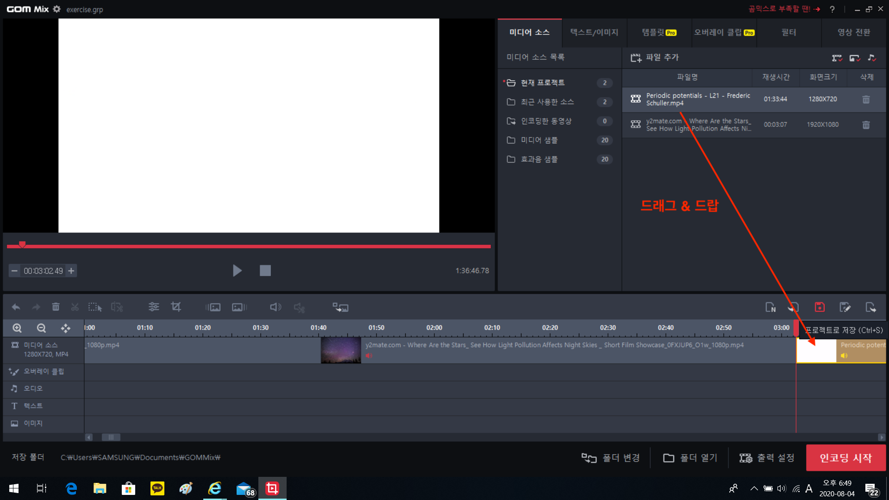

#### STEP 4.5 전환효과 넣기

STEP 4에서 이어붙이기를 했는데, 이렇게 하면 갑자기 영상이 뚝! 끝기면서 넘어가요. 뭔가 부자연스러워서 조금 욕심이 난다면 전환효과를 넣어볼 수 있습니다. 파포의 슬라이드 전화효과 같은거라고 생각하면 돼요. 우선 **전환 후**의 영상을 선택해주시고, 영상 전환 탭에 들어가봅시다.
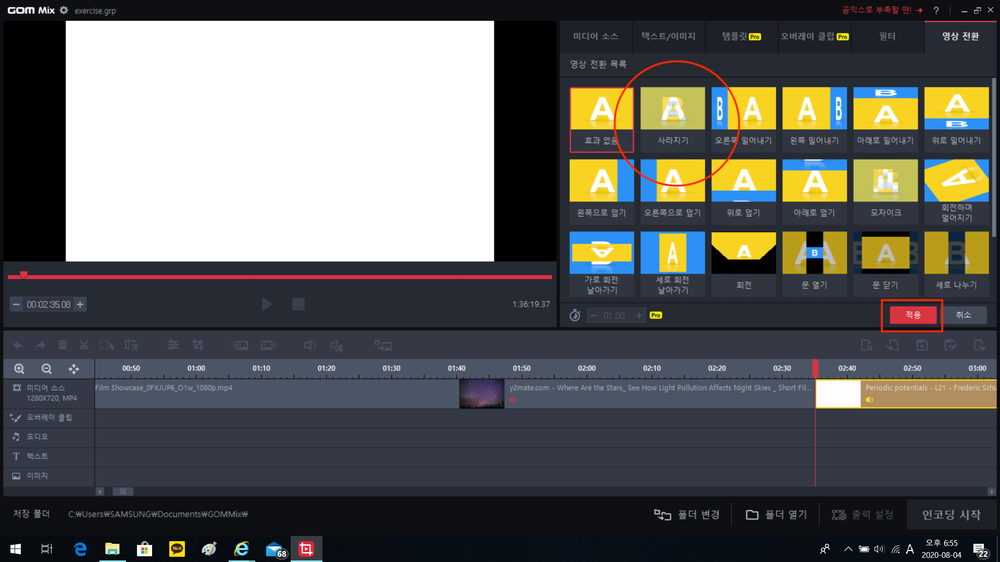
각종 효과가 있는데 그 중에서 사라지기(있어보이는 말로 교차 디졸브라고 합니다)가 가장 무난해요. 선택하고 적용 클릭하면 끝! 그러면 최종 영상에서 조금 더 부드럽게 넘어갑니다. 

#### STEP 5 인코딩

> **이제부터 개중요**

사실 앞에는 강의 보고도 할 수 있고, 이것저것 만져보고 감으로도 할 수 있어요. 그런데 이제부터는 꼭 이대로 해 주셔야 합니다. 우선 아래쪽의 출력 설정 클릭!
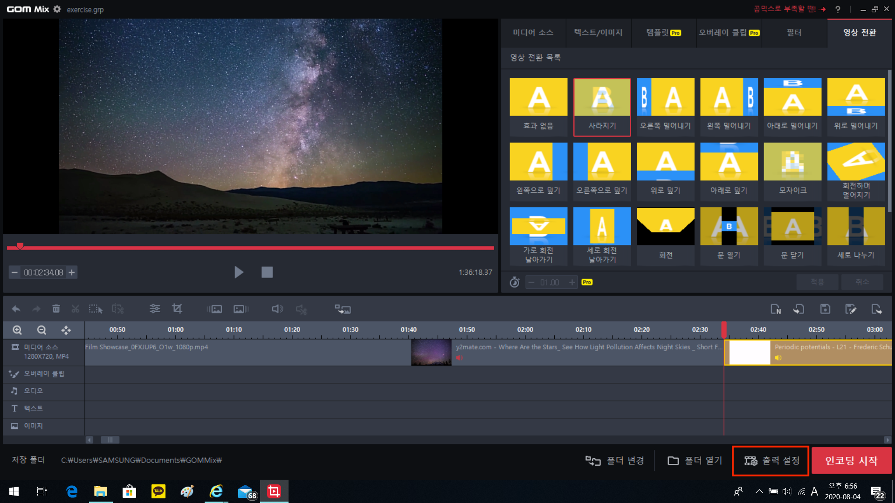
그러면 알아듣기 힘든 말이 가득한 창이 하나 뜨는데 탭이 4개 있을거에요. 이 중에 **코덱**과 **영상**만 건드려줄거에요. 아래 그림의 네모친 부분을 보이는 대로 설정해주세요.
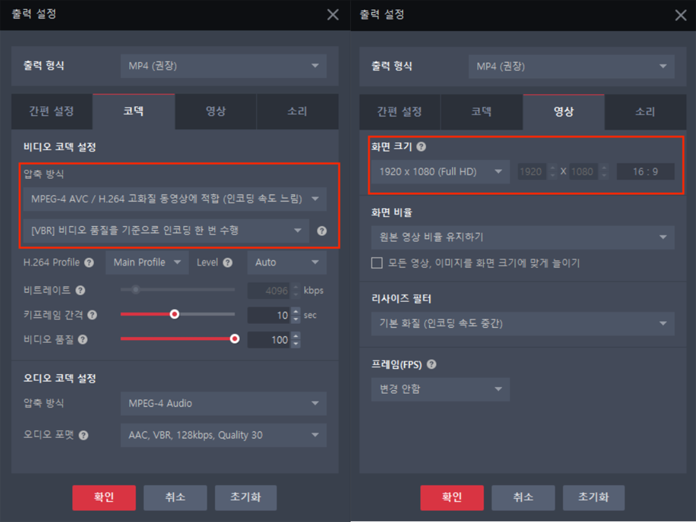
확인 눌러서 팝업 창을 끄면 이제 거의 다 끝났습니다! 프로그램의 오른쪽 구석에서 혼자 빨간색으로 시선강탈하던 인코딩 시작을 누르고, 팝업 창에서 적당히 저장할 위치를 설정한 다음, 다시 인코딩 시작을 클릭!
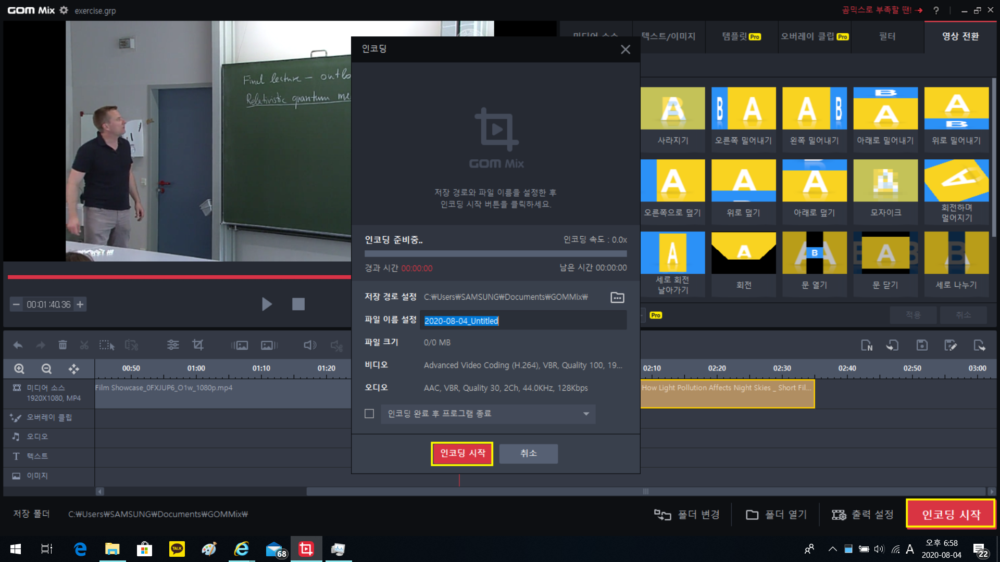
그러면 인코딩이 됩니다. 이제부터는 기다림의 시간인데, 2시간 남짓한 영상을 인코딩하는데 5시간이 넘게 걸립니다;;; 
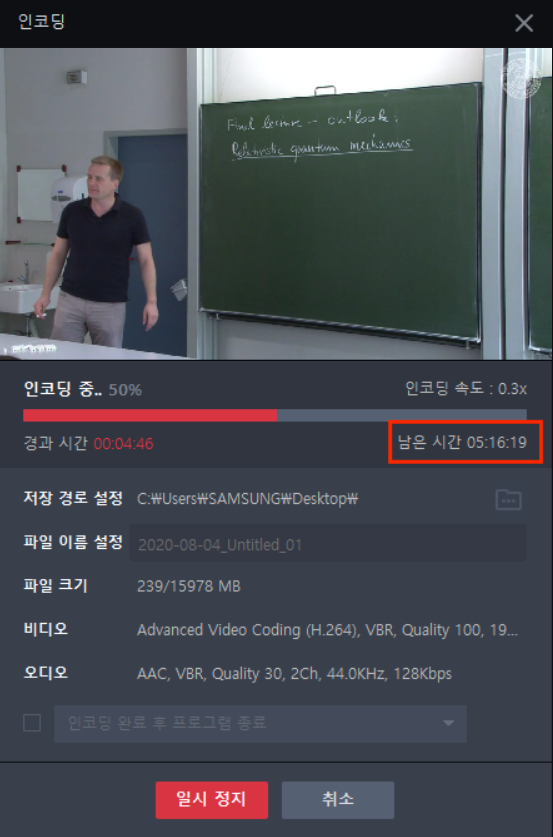

이게 10분 남짓하는 유튜브 편집과 방송 편집이 좀 다른 점인데... 2시간되는 영상을 FHD로 인코딩하는데는 정말 어마어마한 시간과 컴퓨팅이 필요해요... 이 동안 CPU 점유율은 100%를 찍을 거구 여러분은 최소 5시간동안 컴퓨터를 못쓰십니다. **이때 반드시 충전기 연결 & 화면자동잠금 같이 일정시간 안건들면 꺼지는 기능을 다 off 해 주세요** 그리고 한 숨 주무시면 됩니다.

## 난 다른 영상편집 프로그램 쓸 줄 아는데?

프리미어를 이미 쓸 줄 아신다구요? 그럼 그냥 그거 쓰셔도 됩니다! 다만 나중에 아래 그림처럼 출력해주세요.
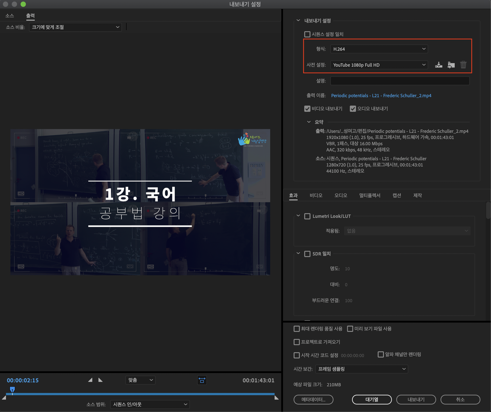